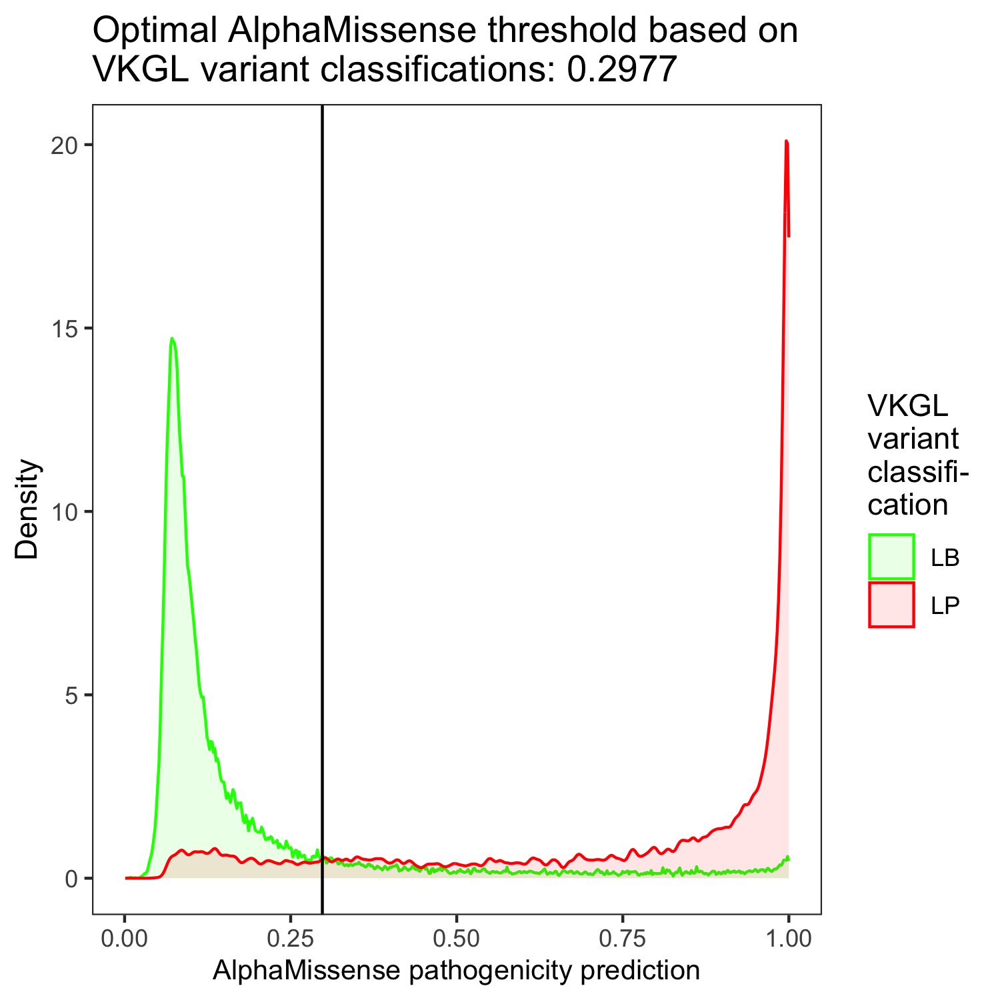
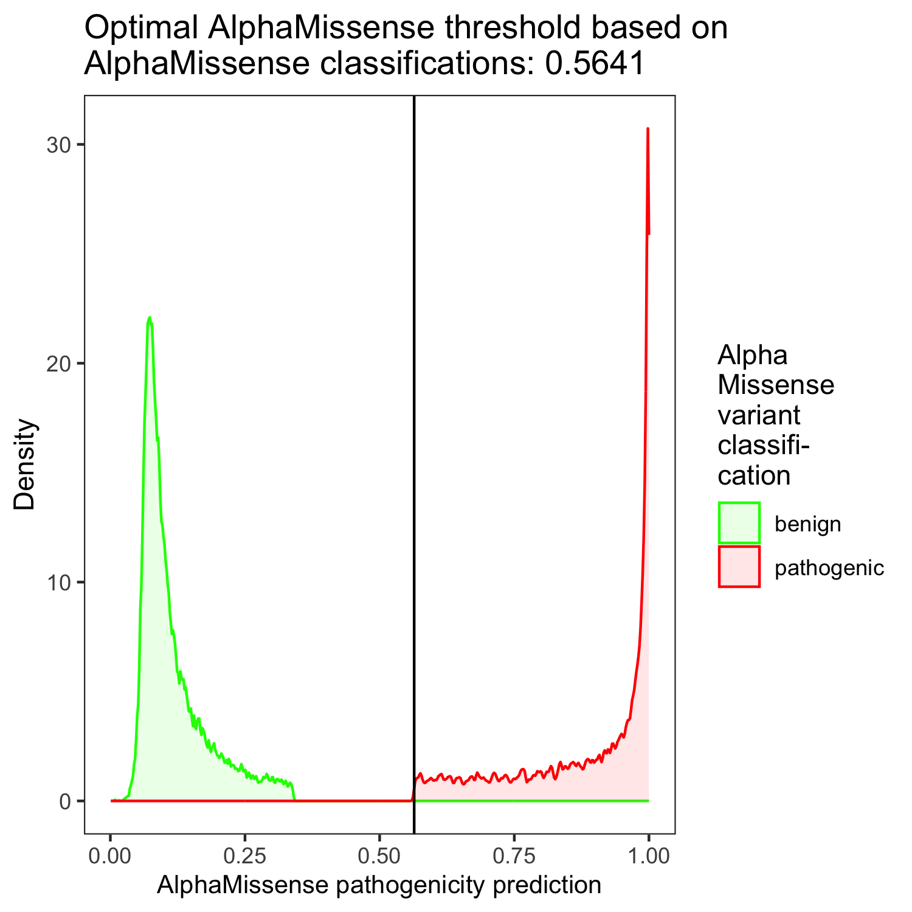

# The optimal AlphaMissense threshold based on 52799 VKGL variant classifications is 0.2977 with PPV 61%, NPV 96%, sensitivity 87% and specificity 86%.

## Sanity check (i.e. verification): re-determining AlphaMissense's own threshold using AlphaMissense classifications resulting from applying that same threshold. The optimal AlphaMissense threshold based on AlphaMissense's own classifications is 0.5641 with PPV 100%, NPV 100%, sensitivity 100% and specificity 100%.

